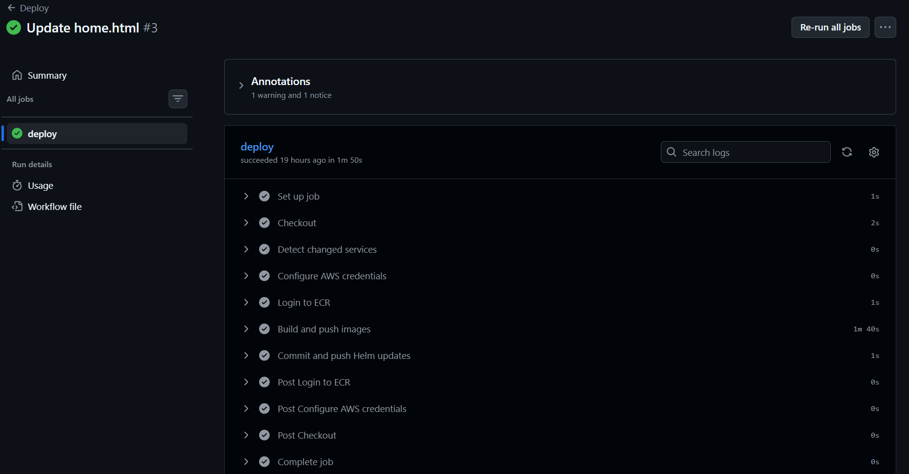
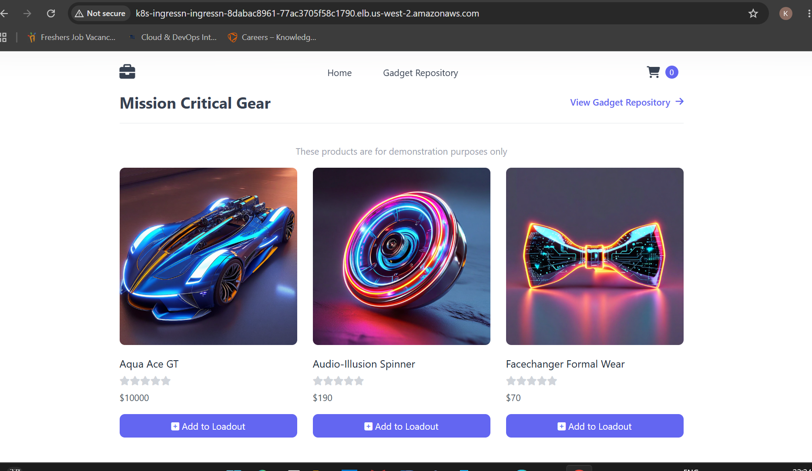
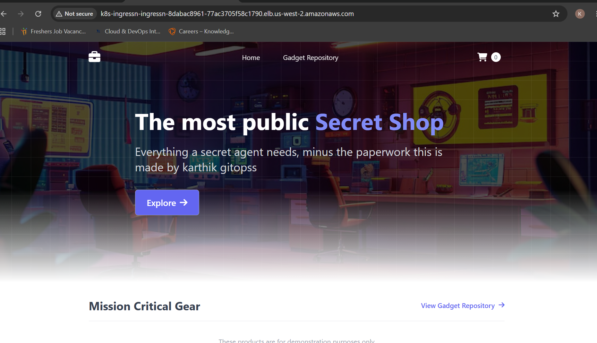
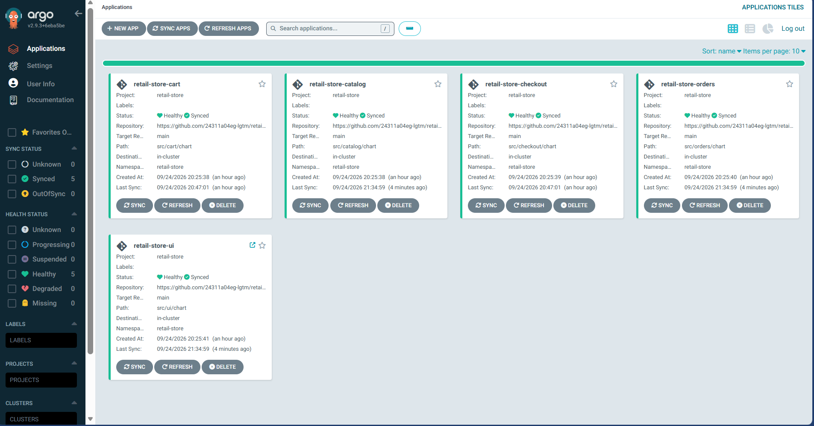

# Retail Store Sample App: GitOps with Amazon EKS Auto Mode


<div align="center">
  <div align="center">

[](Stars)


  </div>

  <strong>
  <h2>AWS Containers Retail Sample</h2>
  </strong>
</div>

This project deploys a complete retail store platform on AWS using Amazon EKS Auto Mode, Terraform, GitHub Actions, and Argo CD. It combines five containerized microservices into a working application and demonstrates an end-to-end workflow for infrastructure provisioning, image delivery, and GitOps-based deployment.

## Table of Contents

- [Overview](#overview)
- [Project Structure](#project-structure)
- [Application Architecture](#application-architecture)
- [Infrastructure Architecture](#infrastructure-architecture)
- [Quick Start](#quick-start)
- [Branch Strategy](#branch-strategy)
  - [Public Application (Main Branch)](#-public-application-main-branch)
  - [Production (GitOps Branch)](#-production-gitops-branch)
- [Prerequisites](#prerequisites)
- [Getting Started](#getting-started)
- [Deployment Steps](#deployment-steps)
  - [Step 1: Configure AWS Credentials](#step-1-configure-aws-credentials)
  - [Step 2: Clone the Repository](#step-2-clone-the-repository)
  - [Step 3: Deploy Infrastructure with Terraform](#step-3-deploy-infrastructure-with-terraform)
    - [Phase 1: Create EKS Cluster](#phase-1-of-terraform-create-eks-cluster)
  - [Step 4: Update kubeconfig](#step-4-update-kubeconfig-to-access-the-amazon-eks-cluster)
    - [Phase 2: Deploy Remaining Configuration](#phase-2-of-terraform-once-you-update-kubeconfig-apply-the-remaining-configuration)
  - [Step 5: GitHub Actions Setup](#step-5-github-actions)
  - [Step 6: Access the Application](#step-6-access-the-application)
  - [Step 7: ArgoCD Deployment](#step-7-argo-cd-automated-deployment)
  - [Step 8: ArgoCD UI Access](#step-8-port-forward-to-argo-cd-ui-and-login)
  - [Step 9: Monitor Deployment](#step-9-monitor-application-deployment)
  - [Step 10: Cleanup](#step-10-cleanup)
- [Troubleshooting](#troubleshooting)
- [License](#license)

## Overview

The Retail Store Sample App demonstrates a modern microservices architecture deployed on AWS EKS using GitOps principles. The application consists of multiple services that work together to provide a complete retail store experience:

- **UI Service**: Java-based frontend
- **Catalog Service**: Go-based product catalog API
- **Cart Service**: Java-based shopping cart API
- **Orders Service**: Java-based order management API
- **Checkout Service**: Node.js-based checkout orchestration API

## Project Structure

```text
argocd/       Argo CD projects and application definitions
docs/         Documentation assets and diagrams
images/       Screenshots used in this README
src/          Retail microservices and their Helm charts
terraform/    AWS networking, EKS, IAM, and platform configuration
```

Each service under `src/` contains its application source, container configuration, tests, and Helm chart. The Terraform configuration provisions the AWS platform, while the Argo CD manifests define how applications are synchronized into the cluster.

## Application Architecture

The application has been deliberately over-engineered to generate multiple de-coupled components. These components generally have different infrastructure dependencies, and may support multiple "backends" (example: Carts service supports MongoDB or DynamoDB).


| Component                  | Language | Container Image                                                             | Helm Chart                                                                        | Description                             |
| -------------------------- | -------- | --------------------------------------------------------------------------- | --------------------------------------------------------------------------------- | --------------------------------------- |
| [UI](./src/ui/)            | Java     | [Link](https://gallery.ecr.aws/aws-containers/retail-store-sample-ui)       | [Link](https://gallery.ecr.aws/aws-containers/retail-store-sample-ui-chart)       | Store user interface                    |
| [Catalog](./src/catalog/)  | Go       | [Link](https://gallery.ecr.aws/aws-containers/retail-store-sample-catalog)  | [Link](https://gallery.ecr.aws/aws-containers/retail-store-sample-catalog-chart)  | Product catalog API                     |
| [Cart](./src/cart/)        | Java     | [Link](https://gallery.ecr.aws/aws-containers/retail-store-sample-cart)     | [Link](https://gallery.ecr.aws/aws-containers/retail-store-sample-cart-chart)     | User shopping carts API                 |
| [Orders](./src/orders)     | Java     | [Link](https://gallery.ecr.aws/aws-containers/retail-store-sample-orders)   | [Link](https://gallery.ecr.aws/aws-containers/retail-store-sample-orders-chart)   | User orders API                         |
| [Checkout](./src/checkout) | Node     | [Link](https://gallery.ecr.aws/aws-containers/retail-store-sample-checkout) | [Link](https://gallery.ecr.aws/aws-containers/retail-store-sample-checkout-chart) | API to orchestrate the checkout process |

## Infrastructure Architecture

The Infrastructure Architecture follows cloud-native best practices:

- **Microservices**: Each component is developed and deployed independently
- **Containerization**: All services run as containers on Kubernetes
- **GitOps**: Infrastructure and application deployment managed through Git
- **Infrastructure as Code**: All AWS resources defined using Terraform
- **CI/CD**: Automated build and deployment pipelines with GitHub Actions


## Quick Start

**Want to deploy immediately?** Follow these steps for a basic deployment:

1. **Install Prerequisites**: AWS CLI, Terraform, kubectl, Docker, Helm
2. **Configure AWS**: `aws configure` with an IAM user, IAM Identity Center profile, or approved deployment identity
3. **Clone Repository**: `git clone https://github.com/iemafzalhassan/retail-store-sample-app.git`
4. **Deploy Infrastructure**: Run Terraform in two phases (see [Getting Started](#getting-started))
5. **Access Application**: Get load balancer URL and browse the retail store

**Need advanced GitOps workflow?** See [BRANCHING_STRATEGY.md](./BRANCHING_STRATEGY.md) for automated CI/CD setup.

## Branch Strategy

This repository uses a **dual-branch approach** for different deployment scenarios:

### 🌐 **Public Application (Main Branch)**
- **Purpose**: Simple deployment with public images
- **Images**: Public ECR (stable versions like v1.2.2)
- **Deployment**: Manual control with umbrella chart
- **Updates**: Manual only
- **Best for**: Demos, learning, quick testing, simple deployments

### 🏭 **Production (GitOps Branch)**
- **Purpose**: Full production workflow with CI/CD pipeline
- **Images**: Private ECR (auto-updated with commit hashes)
- **Deployment**: Automated via GitHub Actions
- **Updates**: Automatic on code changes
- **Best for**: Production environments, automated workflows, enterprise deployments

> **📚 For detailed branching strategy, CI/CD setup, and advanced workflows, see [BRANCHING_STRATEGY.md](./BRANCHING_STRATEGY.md)**


## Prerequisites

Before you begin, ensure you have the following tools installed:

- **AWS CLI** (configured with appropriate credentials)
- **Terraform** (version 1.0.0 or later)
- **kubectl** (compatible with Kubernetes 1.23+)
- **Git** (2.0.0 or later)
- **Docker** (for local development)
- **Helm** 

> [!IMPORTANT]
> Use an IAM principal with only the permissions required for this deployment. Do not use AWS root credentials, commit access keys to Git, or place credentials directly in workflow files.

## Getting Started

Follow these steps to install the required tools before starting the deployment.

- #### 1. AWS CLI:

  * These commands will download and install the **AWS Command Line Interface**.

    ```sh
    curl "https://awscli.amazonaws.com/awscli-exe-linux-x86_64.zip" -o "awscliv2.zip"
    unzip awscliv2.zip
    sudo ./aws/install

    # Verify the installation
    aws --version
    ```

- #### 2. Terraform:

  - **Terraform** download the binary compatible with your operating system and follow the installation steps.

    - <details>
      <summary><strong>Click for Linux & macOS Instructions</strong></summary>

      1.  **Download the Binary**: [Download Terraform](https://releases.hashicorp.com/terraform/1.12.2) find the correct zip file for your system.

      2.  **Install the Binary**: Unzip the file and move the `terraform` executable to a directory in your system's PATH.

        ```sh
        # Example for a downloaded file
        unzip terraform_1.9.0_linux_amd64.zip
        sudo mv terraform /usr/local/bin/
        ```
      3.  **Verify the Installation**:
     
        ```sh
        terraform --version
        ```
      </details>
  
    - <details>
      <summary><strong>Click for Windows Instructions</strong></summary>
  
        * **Official Guide:** [Install Terraform on Windows](https://developer.hashicorp.com/terraform/install)
    
      </details>

- #### 3. kubectl:

  * These commands install a specific version of **kubectl**.

    - <details>
      <summary><strong>Click for macOS Instructions</strong></summary>
  
        ```sh
        # Download the kubectl binary
        curl -LO "https://dl.k8s.io/release/v1.33.3/bin/darwin/arm64/kubectl"

        # Make the binary executable
        chmod +x ./kubectl

          # Move the binary into your PATH
        sudo mv ./kubectl /usr/local/bin/kubectl
        ```

      </details>

    - <details>
      <summary><strong>Click for Linux Instructions</strong></summary>
  
      ```sh
      # Download the kubectl binary
      curl -LO "https://dl.k8s.io/release/v1.33.3/bin/linux/amd64/kubectl"
  
      # Make the binary executable
      chmod +x ./kubectl

      # Move the binary into your PATH
      sudo mv ./kubectl /usr/local/bin/kubectl
      ```
      
      </details>

- #### [4. Docker](https://docs.docker.com/desktop/setup/install/linux/):

  - **Step 1: Set Up the Repository:**

    ```sh
    sudo apt-get update
    sudo apt-get install \
        ca-certificates \
        curl \
        gnupg
    ```

  - **Step 2: Add Docker’s Official GPG Key:**

    ```sh
    sudo install -m 0755 -d /etc/apt/keyrings
    curl -fsSL https://download.docker.com/linux/ubuntu/gpg | sudo gpg --dearmor -o /etc/apt/keyrings/docker.gpg
    sudo chmod a+r /etc/apt/keyrings/docker.gpg
    ```
  
  - **Step 3: Set Up the Docker Repository:**

    ```sh
    echo \
      "deb [arch=$(dpkg --print-architecture) signed-by=/etc/apt/keyrings/docker.gpg] https://download.docker.com/linux/ubuntu \
      $(. /etc/os-release && echo "$VERSION_CODENAME") stable" | \
      sudo tee /etc/apt/sources.list.d/docker.list > /dev/null
    ```


  - **Step 4: Install Docker Engine:**
    
    ```sh
    sudo apt-get update
    sudo apt-get install docker-ce docker-ce-cli containerd.io docker-buildx-plugin docker-compose-plugin

    # Verify the installation
    docker --version
    ```

- #### 5. Helm:
  
      ```sh
      curl -fsSL -o get_helm.sh https://raw.githubusercontent.com/helm/helm/main/scripts/get-helm-3
      chmod 700 get_helm.sh
      ./get_helm.sh --version v3.18.4
      ```


## Deployment Steps

### Step 1: Configure AWS Credentials

Configure the AWS CLI with an IAM user, IAM Identity Center profile, or another approved deployment identity:

```sh
aws configure
```

### Step 2. Clone the Repository:

```sh
git clone https://github.com/iemafzalhassan/retail-store-sample-app.git
cd retail-store-sample-app
```

### Step 3: Deploy Infrastructure with Terraform

The deployment is split into two phases for better control:


### Phase 1 of Terraform: Create EKS Cluster 

```sh
cd terraform
terraform init
terraform apply -target=module.retail_app_eks -target=module.vpc --auto-approve
```


This creates the core infrastructure, including:
- VPC with public and private subnets
- Amazon EKS cluster with Auto Mode enabled
- Bastion host for secure cluster access
- Security groups and IAM roles
  

### Step 4: Update kubeconfig to Access the Amazon EKS Cluster

Terraform creates the cluster with a unique suffix. Run this command from the `terraform` directory so the generated cluster name is used:

```
aws eks update-kubeconfig --name "$(terraform output -raw cluster_name)" --region <region>
```

### Phase 2 of Terraform: Once you update kubeconfig, apply the Remaining Configuration:

```bash
terraform apply --auto-approve
```

This deploys:
- Argo CD for GitOps application delivery
- NGINX Ingress Controller
- Cert Manager for SSL certificates

> [!TIP]
> Application is live with Public image:

- Get your ingress EXTERNAL-IP and paste it in the browser to access retail-store application.
    ```sh
    kubectl get svc -n ingress-nginx
    ```

> [!NOTE]
> The next step enables the private ECR workflow. GitHub Actions builds service images, pushes them to Amazon ECR, and updates the deployment configuration used by Argo CD.
### Step 5: GitHub Actions:

For GitHub Actions, first configure secrets so the pipelines can be automatically triggered:

**Create an IAM User, policies, and generate credentials**

**Go to your GitHub repo → Settings → Secrets and variables → Actions → New repository secret.**

| Secret Name           | Value                              |
|-----------------------|------------------------------------|
| `AWS_ACCESS_KEY_ID`   | `Your AWS Access Key ID`           |
| `AWS_SECRET_ACCESS_KEY` | `Your AWS Secret Access Key`     |
| `AWS_REGION`          | `region-name`                       |
| `AWS_ACCOUNT_ID`        | `your-account-id` |

> [!IMPORTANT]
> Once the entire cluster is created, any changes pushed to the repository will automatically trigger GitHub Actions.

GitHub Actions will automatically build and push the updated Docker images to Amazon ECR.





### Verify Deployment

Check if the nodes are running:

```bash
kubectl get nodes
```

### Step 6: Access the Application:

The application is exposed through the NGINX Ingress Controller. Get the load balancer URL:

```bash
kubectl get svc -n ingress-nginx
```

Use the EXTERNAL-IP of the ingress-nginx-controller service to access the application.





### Step 7: Argo CD Automated Deployment:

**Verify ArgoCD installation**

```
kubectl get pods -n argocd
```




### Step 8: Port-forward to Argo CD UI and login:

**Get ArgoCD admin password**
```
kubectl -n argocd get secret argocd-initial-admin-secret -o jsonpath='{.data.password}' | base64 -d
```

**Port-forward to Argo CD UI**
```
kubectl port-forward svc/argocd-server -n argocd 8080:443 &
```

Open your browser and navigate to:
https://localhost:8080

Username: admin 

Password: <output of previous command>


### Step 9: Monitor application deployment
```
kubectl get pods -n retail-store
kubectl get ingress -n retail-store
```

### Step 10: Cleanup

To delete all resources created by Terraform:


**For Phase 1: Run this command**

```bash
terraform destroy -target=module.retail_app_eks --auto-approve
```

**For Phase 2: Run this command**
```
terraform destroy --auto-approve
```


> [!NOTE]
> Delete the ECR repositories manually from the AWS Console after the Terraform resources have been removed.

## Troubleshooting

### The load balancer has no external address

Wait a few minutes for AWS to provision the load balancer, then check its status again:

```bash
kubectl get svc -n ingress-nginx
kubectl describe svc ingress-nginx-controller -n ingress-nginx
```

### Argo CD applications are out of sync

Check the application status and inspect the related pods and events:

```bash
kubectl get applications -n argocd
kubectl get pods -n retail-store
kubectl get events -n retail-store --sort-by=.lastTimestamp
```

### GitHub Actions cannot push to Amazon ECR

Verify that the repository secrets are present, the AWS region and account ID are correct, and the IAM principal has permission to authenticate to ECR and push images. Never solve this by committing credentials to the repository.


## License

This project is licensed under the Apache License 2.0 - see the [LICENSE](./LICENSE) file for details.
